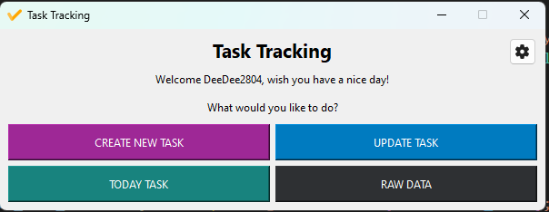

# Simple Task Tracking application
To use this application please install the necessary module as below
```powershell
pip install pandas PySide6 openpyxl
```

Then run the gui.py to start the application.

### Function

The appication will read the data from the excel file (same as the template Test.xlsx).

Then we can create or update the task directly in the application.

Or you can see the tasks need to do within today in today tasks.
### Preview
